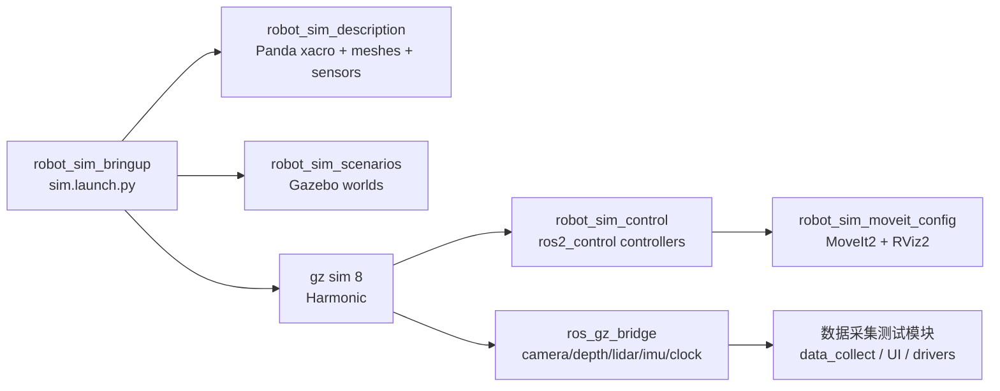

# robot_sim Gazebo 仿真工作空间

<p align="center">
  
  
  
  
</p>

`robot_sim` 是以 Gazebo 仿真和机器人运控验证为主的 ROS 2 Humble 工作空间。当前主线是 `robot_sim_*` 包族：用 Panda 机械臂在 `gz sim 8` 中跑通模型、场景、`gz_ros2_control`、轨迹控制、MoveIt2、RViz2 和传感器桥接。

仓库中仍保留数据采集、相机、Fanuc、UI 等包，但它们现在定位为仿真联调和采集链路测试的辅助模块，不再是项目主叙事。

## 快速启动

```bash
cd /home/kyle/sany/robot_sim
source /opt/ros/humble/setup.bash
export GZ_VERSION=harmonic

colcon build --symlink-install --allow-overriding gz_ros2_control --packages-select \
  gz_ros2_control \
  robot_sim_description robot_sim_control robot_sim_scenarios \
  robot_sim_moveit_config robot_sim_bringup

source install/setup.bash
ros2 launch robot_sim_bringup sim.launch.py
```

默认 `sim_mode:=light` 会启动 Gazebo 和 `gz_ros2_control`，关闭传感器、MoveIt2 和 RViz2，适合日常调控制链。

完整仿真：

```bash
ros2 launch robot_sim_bringup sim.launch.py sim_mode:=full
```

纯 ROS 控制链 mock：

```bash
ros2 launch robot_sim_bringup sim.launch.py sim_mode:=mock
```

## 仿真模式

| 模式 | Gazebo | 控制链 | 传感器 | MoveIt2 / RViz2 | 适用场景 |
| --- | --- | --- | --- | --- | --- |
| `mock` | 否 | `mock_components/GenericSystem` | 否 | 默认关闭 | 快速验证 controller、action 和 launch 参数 |
| `light` | 是 | `gz_ros2_control/GazeboSimSystem` | 默认关闭 | 默认关闭 | 日常运控开发和 Gazebo 物理链路调试 |
| `full` | 是 | `gz_ros2_control/GazeboSimSystem` | 默认开启 | 默认开启 | 传感器、规划、RViz2 和端到端演示 |

传感器支持按组打开：

```bash
ros2 launch robot_sim_bringup sim.launch.py \
  sim_mode:=light \
  enable_camera:=true \
  enable_depth:=false \
  enable_lidar:=true \
  enable_imu:=true
```

## 运控验收

查看控制器：

```bash
ros2 control list_controllers
ros2 topic echo /joint_states --once
```

发送一条 Panda 关节轨迹：

```bash
ros2 action send_goal /arm_controller/follow_joint_trajectory \
  control_msgs/action/FollowJointTrajectory \
  "{trajectory: {joint_names: [panda_joint1, panda_joint2, panda_joint3, panda_joint4, panda_joint5, panda_joint6, panda_joint7], points: [{positions: [0.2, -0.6, 0.1, -2.2, 0.1, 1.4, 0.6], time_from_start: {sec: 2}}]}}"
```

完整模式下检查传感器：

```bash
ros2 topic hz /camera/color/image_raw
ros2 topic hz /camera/depth/image_raw
ros2 topic hz /camera/points
ros2 topic hz /scan
ros2 topic hz /lidar/points
ros2 topic echo /imu/data --once
```

## 系统结构



## 关键包

| 路径 | 当前定位 |
| --- | --- |
| `src/robot_sim_bringup/` | 仿真总入口，提供单机、传感器桥接和本机分布式 launch |
| `src/robot_sim_description/` | Panda 机械臂、夹爪、相机挂载、传感器和 Gazebo 插件描述 |
| `src/robot_sim_control/` | `joint_state_broadcaster`、`arm_controller`、可选 `gripper_controller` 配置 |
| `src/robot_sim_scenarios/` | Gazebo world 场景 |
| `src/robot_sim_moveit_config/` | Panda MoveIt2 规划和执行配置 |
| `src/gz_ros2_control/` | Humble + gz sim 8/Harmonic 使用的源码 overlay |
| `src/data_collect*`、`src/camera_*`、`src/fanuc_robot/` | 采集链路和真实设备测试辅助模块 |

## 本机分布式仿真

用于模拟后续控制、传感器、规划和监督进程拆分：

```bash
ros2 launch robot_sim_bringup distributed_local.launch.py rviz:=false headless:=true
```

常用 namespace：

| Namespace | 内容 |
| --- | --- |
| `/robot` | robot_state_publisher、controller_manager、MoveIt2 |
| `/sensors` | camera、depth、lidar、imu、clock bridge |
| `/supervisor` | 本机监督与图结构调试预留 |

验收：

```bash
ros2 topic list | grep -E '^/(robot|sensors|supervisor)'
ros2 control list_controllers -c /robot/controller_manager
```

## ROS 2 录包辅助

仓库提供 `record_bag.launch.py`，用于在仿真或本机分布式运行时快速录制关键 topic。建议先启动仿真，再另开终端录包：

```bash
cd /home/kyle/sany/robot_sim
source /opt/ros/humble/setup.bash
source install/setup.bash

ros2 launch robot_sim_bringup record_bag.launch.py topic_group:=all
```

默认输出到 `~/robot_sim_bags/robot_sim_<topic_group>_<timestamp>`。常用组：

| 组 | 录制内容 |
| --- | --- |
| `control` | `/clock`、TF、`/joint_states`、arm/gripper controller 状态和轨迹 topic |
| `sensors` | `/clock`、TF、RGB、深度、点云、LaserScan、lidar 点云和 IMU |
| `all` | 单机仿真的控制和传感器 topic |
| `distributed` | `distributed_local.launch.py` 下的 `/robot`、`/sensors` 命名空间 topic |
| `custom` | 只录制 `extra_topics` 中指定的 topic |

示例：

```bash
ros2 launch robot_sim_bringup record_bag.launch.py \
  topic_group:=sensors \
  bag_name:=camera_lidar_test \
  compression:=true

ros2 launch robot_sim_bringup record_bag.launch.py \
  topic_group:=custom \
  extra_topics:="/joint_states /camera/points /tf /tf_static"
```

## 文档站

当前仓库已经提供 docsify 文档站，入口在 `docs/index.html`。本地预览：

```bash
cd /home/kyle/sany/robot_sim
python3 -m http.server 3000 --directory docs
```

浏览器打开：

```text
http://localhost:3000
```

优先阅读：

- `docs/guide/simulation.md`：仿真模式、传感器开关和控制链说明。
- `docs/guide/rosbag-recording.md`：ROS 2 录包辅助入口和参数说明。
- `docs/guide/run-app.md`：开发编译和运行入口。
- `docs/modules/README.md`：包职责索引。
- `docs/workflow/testing.md`：验收检查项。

## 数据采集测试

采集相关包仍可用于验证仿真传感器话题、真实相机、Fanuc 状态和桌面 UI 流程。只做采集链路测试时，可以按需编译：

```bash
colcon build --symlink-install --packages-select \
  weld_interface file_reader data_collect data_collect_quality data_collect_ui
```

真实设备驱动依赖 RVC SDK、MVSDK 和 Fanuc 共享库；缺少厂商 SDK 时，建议先使用 `robot_sim_bringup` 的仿真话题完成运控和接口联调。
