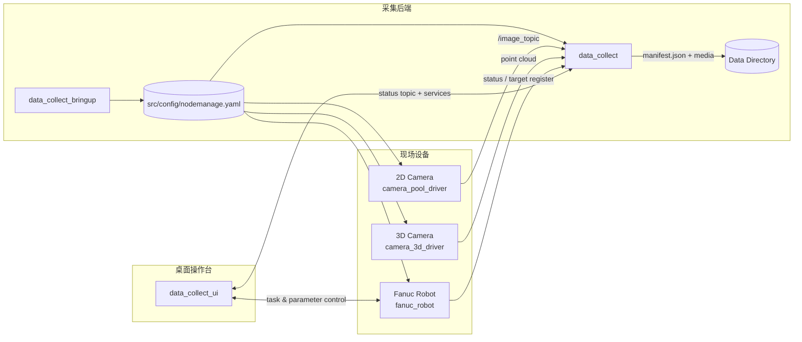

# 焊接数据采集工作空间

<p align="center">
  
  
  
  
  
</p>

<p align="center">
  
</p>

这是一个独立的 ROS 2 Humble 工作空间，用于焊接现场的数据采集、状态记录与桌面可视化管理。项目从 `autocover_G36` 中拆分而来，只保留采集相关能力；运行本工作空间不需要原始工作空间，也不会修改原始工作空间内容。

## 简介

本仓库面向焊接产线的数据采集场景，提供 2D 相机、3D 相机、Fanuc 机器人状态、采集控制和桌面操作台的一体化能力。README 按常见开源项目的写法组织，便于快速了解项目、安装、配置和参与开发。

## 系统架构

下图展示了现场设备、采集后端和桌面操作台之间的主要数据流。



## 主要特性

本工作空间当前支持：

- 采集 2D 相机图像。
- 采集 3D 相机固定扫描点云。
- 记录 Fanuc 机器人 TCP 位姿。
- 记录 Fanuc 焊接状态、程序状态、报警、急停、倍率、电流、电压、送丝速度等信息。
- 根据 Fanuc 焊接检测信号自动开始/停止采集。
- 通过 ROS 服务手动开始/停止采集。
- 按目标寄存器值、日期、时间组织数据目录。
- 为每次采集生成 `manifest.json` 元数据文件。
- 通过 `/data_collect_status` 发布采集状态，供桌面界面和监控工具使用。
- 提供桌面操作台 `data_collect_ui`，用于采集控制、任务录入、图像预览、历史数据检索和导出。

## 仓库结构

- `camera_pool_driver`：2D 相机发布节点。
- `camera_3d_driver`：3D 相机固定扫描节点。
- `fanuc_robot`：Fanuc 机器人状态发布和机器人服务节点。
- `data_collect`：核心采集节点，负责保存图像、点云、机器人位姿、Fanuc 状态和采集元数据。
- `data_collect_ui`：桌面操作界面，用于查看采集状态、Fanuc 状态，并控制采集启停。
- `data_collect_bringup`：独立 launch 和默认配置入口。
- `weld_interface`：本工作空间使用的 ROS 2 消息和服务定义。
- `file_reader`：YAML/JSON 配置读取工具。
- `config`：工作空间默认配置文件与运行参数样例。
- `packaging`：deb 打包脚本和安装包相关资源。

## 环境要求

基础环境：

- Ubuntu 22.04
- ROS 2 Humble
- `colcon`
- OpenCV、PCL、cv_bridge 等 ROS 依赖

硬件/SDK 相关依赖：

- 运行 3D 相机节点需要 RVC SDK。
- 运行 2D 相机节点需要对应 MVSDK。
- 运行 Fanuc 机器人节点需要 Fanuc 共享库及其依赖。

桌面界面依赖：

```bash
sudo apt install python3-pyqt5 python3-yaml
```

界面优先使用 PySide6；如果系统没有 PySide6，会自动尝试使用 PyQt5。生产安装建议使用 apt 安装 PyQt5，便于做 deb 依赖闭环。

## 编译

```bash
cd /home/kyle/sany/weld_data_collect_ws
source /opt/ros/humble/setup.bash
colcon build --symlink-install
```

编译完成后，每次打开新终端都需要加载环境：

```bash
cd /home/kyle/sany/weld_data_collect_ws
source /opt/ros/humble/setup.bash
source install/setup.bash
```

如果主机未安装 RVC SDK、MVSDK 或 Fanuc 共享库，相关驱动包可能在编译或运行时失败。只调试采集节点或界面时，可以按需选择包编译：

```bash
colcon build --symlink-install --packages-select weld_interface data_collect data_collect_ui
```

## Debian 安装包

工作空间已提供 deb 打包脚本：

```bash
cd /home/kyle/sany/weld_data_collect_ws
bash packaging/build_deb.sh
```

输出文件位于：

```text
dist/weld-data-collect_0.1.0-1_amd64.deb
```

目标机安装：

```bash
sudo apt install ./dist/weld-data-collect_0.1.0-1_amd64.deb
weld-data-collect-check
```

安装后常用命令：

```bash
weld-data-collect
weld-data-collect-ui
```

默认配置安装到 `/etc/weld_data_collect/nodemanage.yaml`，默认数据目录为 `/var/lib/weld_data_collect/data`。

底层依赖建议：

- ROS 2、Qt、PCL、cv_bridge、yaml-cpp 等通用依赖由 deb 的 `Depends` 交给 apt 安装。
- Fanuc `libFanucRobot.so` 当前体积小且已在仓库中，打包脚本默认放入 `/opt/weld_data_collect/vendor/fanuc/lib`。
- RVC SDK、MVSDK 不建议直接塞进主 deb。它们通常包含厂商授权、udev 规则、内核/USB/网络调优和硬件版本差异，推荐预装到目标机，或单独制作 `vendor` deb。
- 如果打包时提示链接到了 `/usr/local/lib/libopencv*.so`，说明构建机有自定义 OpenCV。生产包建议在干净的 Ubuntu 22.04 + ROS 2 Humble 环境中重新构建。

## 配置文件

默认配置文件位于：

```text
src/config/nodemanage.yaml
```

启动时 `data_collect.launch.py` 会把这个 YAML 传给 2D 相机、3D 相机和 Fanuc 节点；`data_collect_node` 也会通过 `AUTOCOVER_NODEMANAGE_YAML` 读取同一个文件。界面中的 `参数设置` 页会直接修改这个 YAML。

常用参数：

```yaml
robot_driver_fanuc:
  ros__parameters:
    so_file_path: '/home/kyle/sany/weld_data_collect_ws/src/fanuc_robot/lib/libFanucRobot.so'
    robot_ip: '10.16.140.114'
    robot_port: 60008
    target_register_index: 100

data_collect_node:
  ros__parameters:
    save_dir_root: '/home/kyle/sany/weld_data_collect_ws/data'
    image_save_interval: 12
    image_log_save_interval: 3
    height_log_save_interval: 4
    fix_scan_interval: 6
    auto_save_flag: 0
    target_register_index: 100

camera_node:
  ros__parameters:
    trigger_mode: 2
    strobe_polarity: 0
    saturation: 64
    gamma: 106
    exposure_time: 4.3
    analog_gain: 64
    frame_rate: 60.0
```

参数含义：

- `save_dir_root`：采集数据保存根目录。
- `image_save_interval`：2D 图像保存间隔。
- `image_log_save_interval`：图像日志保存间隔。
- `height_log_save_interval`：高度日志图像保存间隔。
- `fix_scan_interval`：固定扫描点云保存间隔。
- `auto_save_flag`：是否根据 Fanuc 焊接检测信号自动启停采集，`0` 为手动，非 `0` 为自动。
- `target_register_index`：用于区分数据类别或工件类别的 Fanuc 目标寄存器编号。
- `camera_node.trigger_mode`：2D 相机触发模式。
- `camera_node.strobe_polarity`：2D 相机频闪极性。
- `camera_node.saturation`：2D 相机饱和度。
- `camera_node.gamma`：2D 相机 Gamma。
- `camera_node.exposure_time`：2D 相机曝光时间。
- `camera_node.analog_gain`：2D 相机模拟增益。
- `camera_node.frame_rate`：2D 图像发布频率。

## 启动采集后端

方式一：使用 launch 启动完整采集栈。

```bash
cd /home/kyle/sany/weld_data_collect_ws
source /opt/ros/humble/setup.bash
source install/setup.bash
ros2 launch data_collect_bringup data_collect.launch.py
```

常用 launch 参数覆盖示例：

```bash
ros2 launch data_collect_bringup data_collect.launch.py \
  nodemanage_yaml:=/path/to/nodemanage.yaml \
  robot_ip:=10.16.140.114 \
  fanuc_so_path:=/path/to/libFanucRobot.so
```

可以按需关闭部分节点：

```bash
ros2 launch data_collect_bringup data_collect.launch.py \
  enable_fanuc:=false \
  enable_camera_3d:=false \
  enable_camera_2d:=false
```

方式二：使用脚本启动，并自动调用固定扫描和采集服务。

```bash
cd /home/kyle/sany/weld_data_collect_ws
source /opt/ros/humble/setup.bash
source install/setup.bash
bash src/data_collect/start_data_collect_stack.sh
```

脚本支持通过环境变量控制开关：

```bash
ENABLE_FANUC=0 \
ENABLE_CAMERA_3D=0 \
ENABLE_CAMERA_2D=0 \
AUTO_START_FIX_SCAN=0 \
AUTO_ACTIVATE_COLLECT=0 \
bash src/data_collect/start_data_collect_stack.sh
```

## 启动桌面操作界面

启动后端后，在另一个终端运行：

```bash
cd /home/kyle/sany/weld_data_collect_ws
source /opt/ros/humble/setup.bash
source install/setup.bash
ros2 run data_collect_ui data_collect_ui
```

界面分为三个页签：

- `采集操作`：查看 ROS、采集、Fanuc 状态；填写任务号、工件号、焊道号、操作员、班次和备注；调用采集启停和 3D 固定扫描服务。
- `实时预览`：显示 `/image_topic` 的 2D 图像预览，并同步显示图像、日志、点云计数和当前保存目录。
- `历史数据`：扫描数据根目录下的 `manifest.json`，按表格展示采集记录，并支持打开目录和导出 ZIP。
- `参数设置`：查看和修改后端统一配置文件 `nodemanage.yaml`，修改完成后自动保存。

界面按钮包括：

- `保存任务信息`：调用 `/data_collect_set_task`，任务信息会写入后续采集的 `manifest.json`。
- `启动采集`、`停止采集`。
- `开始3D扫描`、`停止3D扫描`。
- `打开保存目录`。
- `刷新` 历史数据。
- `导出ZIP` 历史采集包。
- 修改后端参数后，界面会自动保存到 YAML；硬件初始化类参数通常需要重启采集后端后生效。

如果启动时报错缺少 Qt Python 绑定，请先安装：

```bash
sudo apt install python3-pyqt5
```

## 常用服务

手动开始采集：

```bash
ros2 service call /data_collect_activate std_srvs/srv/Empty "{}"
```

手动停止采集：

```bash
ros2 service call /data_collect_deactivate std_srvs/srv/Empty "{}"
```

开始 3D 固定扫描：

```bash
ros2 service call /start_fix_scan std_srvs/srv/Empty "{}"
```

停止 3D 固定扫描：

```bash
ros2 service call /stop_fix_scan std_srvs/srv/Empty "{}"
```

设置当前采集任务信息：

```bash
ros2 service call /data_collect_set_task weld_interface/srv/SetCollectionTask \
  "{task_id: T-001, workpiece_id: WP-01, weld_seam_id: S-01, operator_name: zhang, shift: day, notes: test}"
```

## 采集状态话题

采集节点会发布状态话题：

```bash
ros2 topic echo /data_collect_status
```

状态内容包括：

- `running`：当前是否正在采集。
- `auto_save`：是否启用自动采集模式。
- `current_save_dir`：当前采集保存目录。
- `target_register_index`：目标寄存器编号。
- `target_register_value`：目标寄存器当前值。
- `has_target_register_value`：是否已经收到寄存器值。
- `task_id`：任务号。
- `workpiece_id`：工件号。
- `weld_seam_id`：焊道号。
- `operator_name`：操作员。
- `shift`：班次。
- `notes`：备注。
- `image_count`：已保存图像数量。
- `point_cloud_count`：已保存点云数量。
- `tool_pose_count`：已保存工具位姿记录数量。
- `fanuc_info_count`：已保存 Fanuc 状态记录数量。
- `last_error`：最近一次写入错误。

## 数据目录结构

每次采集会生成一个独立目录：

```text
data/<target_register_value>/<YYYY-MM-DD>/<HH-MM-SS>/
```

如果启动采集时还没有收到目标寄存器值，会使用：

```text
data/unknown/<YYYY-MM-DD>/<HH-MM-SS>/
```

典型目录结构：

```text
camera/                 2D 图像
camera_log/             图像日志
height_log/             高度日志图像
scan_point_cloud/       3D 点云 PLY 文件
robot_state/            TCP 位姿 CSV
fanuc_robot_info/       Fanuc 状态 CSV
collection_meta.txt     兼容旧流程的简单元数据
manifest.json           标准采集元数据
```

`manifest.json` 会记录：

## License

This project is licensed under the MIT License — see the [LICENSE](LICENSE) file for details.

- 采集开始时间。
- 采集结束时间。
- 采集状态。
- 保存目录。
- 采样间隔。
- 任务号、工件号、焊道号、操作员、班次、备注。
- 目标寄存器编号和值。
- 来源 topic。
- 各类数据保存数量。
- 最近错误。

## 历史数据管理

桌面操作台的 `历史数据` 页会从数据根目录递归查找 `manifest.json`。默认数据根目录为：

```text
/home/kyle/sany/weld_data_collect_ws/data
```

也可以通过环境变量覆盖：

```bash
WELD_DATA_ROOT=/path/to/data ros2 run data_collect_ui data_collect_ui
```

历史数据页支持：

- 按表格查看采集状态、开始/结束时间、任务号、工件号、焊道号、寄存器值、图像数量、点云数量和路径。
- 打开选中采集记录的目录。
- 将选中采集记录导出为 ZIP 文件。

## 快速自检

查看节点：

```bash
ros2 node list
```

查看服务：

```bash
ros2 service list
```

查看采集状态：

```bash
ros2 topic echo --once /data_collect_status
```

查看 Fanuc 状态：

```bash
ros2 topic echo --once /fanuc_robot_info
```

查看 2D 图像 topic：

```bash
ros2 topic hz /image_topic
```

查看 3D 点云 topic：

```bash
ros2 topic hz /tcp_cloud_raw
```

## 常见问题

### 找不到 ROS 包

确认已经加载环境：

```bash
source /opt/ros/humble/setup.bash
source /home/kyle/sany/weld_data_collect_ws/install/setup.bash
```

### UI 无法启动

如果提示缺少 PySide6：

```bash
python3 -m pip install --user PySide6
```

如果按钮是灰色，通常表示对应 ROS 服务还没有启动。请先确认后端节点是否在线：

```bash
ros2 service list | grep -E "data_collect|fix_scan"
```

### 采集目录进入 unknown

说明启动采集时还没有收到 `/fanuc_target_register_value`。请检查 Fanuc 节点是否启动、机器人连接是否正常、`target_register_index` 是否正确。

### 没有点云或图像保存

请先确认采集状态为 `running`，再检查对应 topic 是否有数据：

```bash
ros2 topic echo --once /data_collect_status
ros2 topic hz /image_topic
ros2 topic hz /tcp_cloud_raw
```

### Fanuc 节点启动失败

优先检查：

- `so_file_path` 是否指向真实存在的 `libFanucRobot.so`。
- `robot_ip` 和 `robot_port` 是否正确。
- 当前主机是否能访问机器人控制器。
- Fanuc 共享库依赖是否完整。

## 路线图

第一阶段已经完成采集状态话题和标准元数据文件。

第二阶段已经完成一版可用桌面操作台，支持任务录入、采集控制、Fanuc 状态查看和 2D 图像预览。

第三阶段已经完成一版历史数据管理，支持扫描 `manifest.json`、查看记录、打开目录和导出 ZIP。后续可以继续增加：

- 点云预览或点云文件快速打开。
- 磁盘空间监控。
- 启动前设备自检。
- 采集包完整性检查。
- 按任务号、工件号、焊道号和日期筛选历史数据。

## 贡献

欢迎通过 issue 或 pull request 改进这个项目。提交变更前建议先确认：

- 相关节点可以正常编译。
- README 与实际配置路径保持一致。
- 新增参数或服务有对应说明。

## 许可证

MIT许可协议
