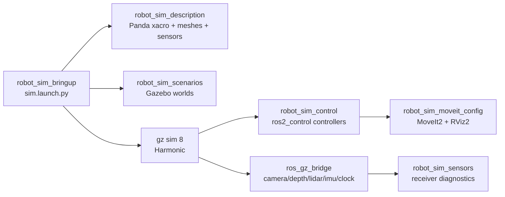

# robot_sim Gazebo 仿真工作空间

<p align="center">
  
  
  
  
</p>

`robot_sim` 是以 Gazebo 仿真和机器人运控验证为主的 ROS 2 Humble 工作空间。当前主线是 `robot_sim_*` 包族：用 Panda/Fanuc 机械臂在 `gz sim 8` 中跑通模型、场景、`gz_ros2_control`、轨迹控制、MoveIt2、RViz2、传感器桥接和仿真传感器接收。

旧的真实硬件耦合驱动包已废弃并移除。`data_collect`、packaging 等旧硬件采集链路本轮暂不维护；新项目优先走 `sim_profile` + `robot_sim_sensors` 的仿真数据接收入口。

## 快速启动

```bash
cd /home/kyle/sany/robot_sim
source /opt/ros/humble/setup.bash
export GZ_VERSION=harmonic

# 如果之前在未设置 GZ_VERSION 时编译过，先清掉旧的 Fortress ABI 缓存。
rm -rf build/gz_ros2_control install/gz_ros2_control

colcon build --symlink-install \
  --allow-overriding gz_ros2_control \
  --packages-select \
    gz_ros2_control \
    robot_sim_description robot_sim_control robot_sim_scenarios \
    robot_sim_moveit_config \
    robot_sim_fanuc_description robot_sim_fanuc_control robot_sim_fanuc_moveit_config \
    robot_sim_sensor_camera robot_sim_sensor_depth robot_sim_sensor_lidar robot_sim_sensor_imu \
    robot_sim_bringup

source install/setup.bash
ros2 launch robot_sim_bringup sim.launch.py
```

默认 `sim_mode:=light` 会启动 Gazebo 和 `gz_ros2_control`，关闭传感器、MoveIt2 和 RViz2，适合日常调控制链。

完整仿真：

```bash
ros2 launch robot_sim_bringup sim.launch.py sim_mode:=full
```

默认会加载 `sim_profile:=panda`。也可以显式指定内置 profile 或外部 profile 文件：

```bash
ros2 launch robot_sim_bringup sim.launch.py sim_profile:=panda sim_mode:=full

ros2 launch robot_sim_bringup sim.launch.py sim_profile:=fanuc_m20id12l sim_mode:=full

ros2 launch robot_sim_bringup sim.launch.py \
  sim_profile_file:=/path/to/custom_robot.yaml \
  sim_mode:=light
```

纯 ROS 控制链 mock：

```bash
ros2 launch robot_sim_bringup sim.launch.py sim_mode:=mock
```

## 仿真模式

| 模式 | Gazebo | 控制链 | 传感器 | MoveIt2 / RViz2 | 适用场景 |
| --- | --- | --- | --- | --- | --- |
| `mock` | 否 | `mock_components/GenericSystem` | 否 | 默认关闭 | 快速验证 controller、action 和 launch 参数 |
| `light` | 是 | `gz_ros2_control/GazeboSimSystem` | 默认关闭 | 默认关闭 | 日常运控开发和 Gazebo 物理链路调试 |
| `full` | 是 | `gz_ros2_control/GazeboSimSystem` | 默认开启 | 默认开启 | 传感器、规划、RViz2 和端到端演示 |

传感器支持按组打开：

```bash
ros2 launch robot_sim_bringup sim.launch.py \
  sim_mode:=light \
  sensor_overrides:=camera=true,depth=false,lidar=true,imu=true
```

## 仿真传感器接收包

`src/robot_sim_sensors/` 是新的传感器总目录，首批提供四个只面向仿真原生话题的 C++ ROS 2 接收包：

| 包 | 接收内容 |
| --- | --- |
| `robot_sim_sensor_camera` | RGB `Image` 和 `CameraInfo` |
| `robot_sim_sensor_depth` | 深度 `Image`、`CameraInfo` 和 `PointCloud2` |
| `robot_sim_sensor_lidar` | `LaserScan` 和 lidar `PointCloud2` |
| `robot_sim_sensor_imu` | `Imu` |

receiver 不兼容旧 `/image_topic`、`/tcp_cloud_raw`、`/scan_3d` 等硬件业务接口，只订阅 `sim_profile` 的 bridge topic，统计消息数、Hz、最后时间戳和 frame，并发布 `/diagnostics`。

仿真启动后，可以单独拉起 receiver：

```bash
ros2 launch robot_sim_bringup sim.launch.py sim_profile:=fanuc_m20id12l sim_mode:=full

ros2 launch robot_sim_bringup sensor_receivers.launch.py sim_profile:=fanuc_m20id12l
```

新机器人迁移时，在 `sensors.<name>.receiver` 中声明 receiver 包、可执行文件和类型；未来新增传感器也按“新增 `robot_sim_sensor_*` 包 + profile 声明”的方式接入。

## 仿真 Profile

`sim_profile` 用 YAML 描述机器人接入所需的仿真资源，当前内置文件为：

```text
src/robot_sim_bringup/config/sim_profiles/panda.yaml
src/robot_sim_bringup/config/sim_profiles/fanuc_m20id12l.yaml
```

新机器人迁移时，`sim_profile` 是唯一入口。建议从模板开始：

```bash
cp src/robot_sim_bringup/config/templates/template_robot.yaml /path/to/custom_robot.yaml
```

填入机器人 xacro、controller yaml、可选 MoveIt 配置、sensor/bridge/topic、world/scenario 和 smoke 验收规则后，先跑 profile lint：

```bash
ros2 run robot_sim_bringup profile_lint --profile panda --mode light --require-receivers

ros2 run robot_sim_bringup profile_lint \
  --profile-file /path/to/custom_robot.yaml \
  --mode full \
  --require-moveit \
  --require-receivers
```

`profile_lint` 会检查路径、通用 xacro 参数、sensor xacro_arg、controller spawner/type、trajectory joints、bridge topic ROS 类型、receiver 可执行文件和静态 TF frame。通过后再启动仿真或 smoke test：

```bash
scripts/sim_smoke_test.sh --profile-file /path/to/custom_robot.yaml --mode full
```

配置拆成四类：

- `config/sim_profiles/*.yaml`：机器人、world、controller、MoveIt、namespace、传感器能力和静态 TF。
- `config/sim_modes.yaml`：`mock/light/full` 默认开关和启动延迟。
- `config/bridge_groups/*.yaml`：旧式全局 bridge group；新项目优先在 profile 的 `bridge_groups` 内联声明。
- `robot_sim_scenarios/scenarios/*.yaml`：base world、可复用 assets 和业务 scenario 的组合关系。

profile 中集中声明：

- 机器人 xacro、spawn 名称和 xacro 参数。
- 单机/分布式 layout 对应的 world scenario。
- ros2_control controllers 文件和需要 spawn 的 controller。
- MoveIt2 的 SRDF、kinematics、joint limits、controller、OMPL 和 RViz 配置。
- Gazebo resource path、clock bridge、传感器 bridge group 和静态 TF。
- `bridge_groups` 内联 bridge topic，或引用外部 bridge config。
- `sensors.<name>.receiver` 声明仿真传感器接收节点。
- `smoke` 验收规则，例如必需 controller、主轨迹 controller、传感器 hz 阈值和额外 TF frame。

新增机器人时，建议复制 `config/templates/template_robot.yaml`，再按已有 `panda.yaml` 对照补齐真实资源。新机器人的 xacro 需要支持这些通用参数：

```text
hardware_plugin
controllers_file
controller_manager_name
use_gz_ros2_control
ros_namespace
```

传感器开关由 profile 的 `sensors.<group>.xacro_arg` 映射，例如 Panda 使用 `enable_camera`、`enable_depth`、`enable_lidar`、`enable_imu`。命令行用 `sensor_overrides:=camera=true,lidar=false` 覆盖任意已声明 sensor group；如果覆盖了不存在的 group，launch 会快速报错。

## 场景组件

Gazebo 场景不再以单个固定 `robot_lab.world.sdf` 作为入口，而是拆成：

- `src/robot_sim_scenarios/worlds/base/`：地面、光照、物理参数和 GUI。
- `src/robot_sim_scenarios/assets/`：桌子、标定板、工件、目标物和障碍物等可复用 SDF 组件。
- `src/robot_sim_scenarios/scenarios/`：把 base world 与 assets 组合成 `lab_demo`、`welding_demo`、`calibration_demo`、`sensor_test`、`planning_obstacles`。

`sim_profile` 只引用 scenario YAML，launch 启动时会生成临时 world 文件并交给 Gazebo。迁移到新项目时，通常只需要复制 assets/scenarios 并改 profile 里的 scenario 引用。

## 仿真验收

换机器人或改 profile 后，优先跑固定 smoke test，而不是只做手工 topic 检查：

```bash
scripts/sim_smoke_test.sh --profile panda --mode full --timeout 120
```

默认会以 `full` 模式、`headless:=true`、`rviz:=false`、`use_moveit:=false` 启动单机仿真，并检查：

- URDF/xacro 能生成且 `check_urdf` 通过。
- Gazebo 能 spawn profile 中的 `spawn_name`。
- `/joint_states` 包含主轨迹控制器关节。
- profile 中启用的 controller 全部 `active`。
- 第一个 `JointTrajectoryController` 的 `follow_joint_trajectory` action 可执行。
- 启用 sensor group 的 bridge topic 有 hz，默认要求大于 1 Hz。
- URDF link 和启用传感器静态 TF frame 在同一棵 TF tree 中。

可选项：

```bash
scripts/sim_smoke_test.sh --profile panda --mode full --with-moveit
scripts/sim_smoke_test.sh --profile panda --mode full --with-rosbag --keep-logs
scripts/sim_smoke_test.sh --profile-file /path/to/custom_robot.yaml --mode full
```

排查单项问题时仍可使用手工命令：

```bash
ros2 control list_controllers
ros2 topic echo /joint_states --once
ros2 topic hz /camera/color/image_raw
```

## 系统结构



## 关键包

| 路径 | 当前定位 |
| --- | --- |
| `src/robot_sim_bringup/` | 仿真总入口，提供单机、传感器桥接和本机分布式 launch |
| `src/robot_sim_description/` | Panda 机械臂、夹爪、相机挂载、传感器和 Gazebo 插件描述 |
| `src/robot_sim_control/` | `joint_state_broadcaster`、`arm_controller`、可选 `gripper_controller` 配置 |
| `src/robot_sim_fanuc_description/` | Fanuc M-20iD/12L ROS2/Gazebo 描述和官方 DAE/STL mesh 资源 |
| `src/robot_sim_fanuc_control/` | Fanuc M-20iD/12L ros2_control controller 配置 |
| `src/robot_sim_fanuc_moveit_config/` | Fanuc M-20iD/12L MoveIt2 配置 |
| `src/robot_sim_sensors/` | camera、depth、lidar、imu 仿真传感器 ROS 2 接收包 |
| `src/robot_sim_scenarios/` | base world、assets 和 scenario 场景 |
| `src/robot_sim_moveit_config/` | Panda MoveIt2 规划和执行配置 |
| `src/gz_ros2_control/` | Humble + gz sim 8/Harmonic 使用的源码 overlay |
| `src/simulation_interfaces/` | 通用仿真 scenario 接口 |
| `src/robot_task_interfaces/` | 通用任务上下文接口 |
| `src/acquisition_interfaces/` | 通用采集状态、质量和任务接口 |
| `src/data_collect*` | 旧采集链路测试辅助，本轮不维护硬件驱动启动入口 |
| `src/weld_interface/` | 焊接业务 adapter 和旧接口兼容层 |

## 本机分布式仿真

用于模拟后续控制、传感器、规划和监督进程拆分：

```bash
ros2 launch robot_sim_bringup distributed_local.launch.py rviz:=false headless:=true
```

常用 namespace：

| Namespace | 内容 |
| --- | --- |
| `/robot` | robot_state_publisher、controller_manager、MoveIt2 |
| `/sensors` | camera、depth、lidar、imu、clock bridge |
| `/supervisor` | 本机监督与图结构调试预留 |

验收：

```bash
ros2 topic list | grep -E '^/(robot|sensors|supervisor)'
ros2 control list_controllers -c /robot/controller_manager
```

## ROS 2 录包辅助

仓库提供 `record_bag.launch.py`，用于在仿真或本机分布式运行时快速录制关键 topic。建议先启动仿真，再另开终端录包：

```bash
cd /home/kyle/sany/robot_sim
source /opt/ros/humble/setup.bash
source install/setup.bash

ros2 launch robot_sim_bringup record_bag.launch.py topic_group:=all
```

录包 topic 现在从 `sim_profile` 的 controller、sensor 和 bridge topic 自动生成。默认输出到 `~/robot_sim_bags/robot_sim_<topic_group>_<timestamp>`。常用组：

| 组 | 录制内容 |
| --- | --- |
| `control` | `/clock`、TF、`/joint_states`、arm/gripper controller 状态和轨迹 topic |
| `sensors` | `/clock`、TF、RGB、深度、点云、LaserScan、lidar 点云和 IMU |
| `all` | 单机仿真的控制和传感器 topic |
| `distributed` | `distributed_local.launch.py` 下的 `/robot`、`/sensors` 命名空间 topic |
| `custom` | 只录制 `extra_topics` 中指定的 topic |

示例：

```bash
ros2 launch robot_sim_bringup record_bag.launch.py \
  sim_profile:=panda \
  topic_group:=sensors \
  bag_name:=camera_lidar_test \
  compression:=true

ros2 launch robot_sim_bringup record_bag.launch.py \
  sim_profile_file:=/path/to/custom_robot.yaml \
  layout:=single \
  topic_group:=custom \
  extra_topics:="/joint_states /camera/points /tf /tf_static"
```

## 文档站

当前仓库已经提供 docsify 文档站，入口在 `docs/index.html`。本地预览：

```bash
cd /home/kyle/sany/robot_sim
python3 -m http.server 3000 --directory docs
```

浏览器打开：

```text
http://localhost:3000
```

优先阅读：

- `docs/guide/simulation.md`：仿真模式、传感器开关和控制链说明。
- `docs/guide/rosbag-recording.md`：ROS 2 录包辅助入口和参数说明。
- `docs/guide/run-app.md`：开发编译和运行入口。
- `docs/modules/README.md`：包职责索引。
- `docs/workflow/testing.md`：验收检查项。

## 数据采集测试

采集相关包仍保留为旧业务链路测试辅助，但真实相机和 Fanuc 硬件驱动包已废弃移除，本轮不维护旧硬件启动和打包入口。只做采集链路测试时，可以按需编译仍可用的接口和采集模块：

```bash
colcon build --symlink-install --packages-select \
  robot_task_interfaces acquisition_interfaces simulation_interfaces \
  weld_interface file_reader data_collect data_collect_quality data_collect_ui
```

新项目优先接入 `/task/set_context`、`/acquisition/set_task`、`/acquisition/status` 和 `/acquisition/quality`。仿真传感器数据请通过 `robot_sim_bringup` 的 bridge topic 和 `robot_sim_sensors` receiver 验证，不再接入旧厂商 SDK 驱动。
