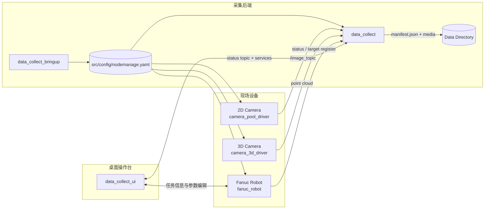

# 焊接数据采集工作空间
----
> 面向焊接现场的 2D 相机、3D 相机、Fanuc 机器人状态采集与桌面操作台工作空间

  

  
  
  
  

  <a href="#主要特性">主要特性</a> ·
  <a href="#系统架构">系统架构</a> ·
  <a href="#快速导航">快速导航</a> ·
  <a href="guide/run-app.md">开发运行</a> ·
  <a href="workflow/testing.md">测试验收</a>

## 项目简介

焊接数据采集工作空间是一个独立的 ROS 2 Humble 工作空间，用于焊接现场的数据采集、状态记录、桌面可视化和任务管理。项目从原始焊接系统中拆分出来，只保留采集相关能力，便于在单独环境中编译、运行和调试。

它围绕“相机采集 -> 机器人状态 -> 采集控制 -> 数据落盘 -> 历史检索”这条主线组织代码，适合现场数据采集、焊接工艺记录、采集任务归档和桌面操作联动。

## 主要特性

- 采集 2D 相机图像。
- 采集 3D 相机固定扫描点云。
- 记录 Fanuc 机器人 TCP 位姿和状态信息。
- 通过 ROS 服务手动开始、停止和恢复采集。
- 按目标寄存器值、日期和时间组织数据目录。
- 为每次采集生成 `manifest.json` 元数据文件。
- 通过 `/data_collect_status` 发布采集状态，供桌面界面和监控工具使用。
- 提供桌面操作台 `data_collect_ui`，用于采集控制、任务录入、图像预览、历史数据检索和配置编辑。

## 系统架构

## 技术栈

| 层级 | 技术 | 用途 |
| --- | --- | --- |
| 桌面运行时 | ROS 2 Humble / colcon | 工作空间编译与运行 |
| 采集节点 | C++ / rclcpp | 相机、机器人和采集状态节点 |
| 桌面界面 | Qt / PyQt5 / PySide6 | 采集控制和历史检索 |
| 图像处理 | OpenCV / cv_bridge | 图像转发与预览 |
| 点云处理 | PCL | 3D 扫描数据保存 |
| 机器人接口 | Fanuc SDK | 机器人状态读取和服务调用 |
| 配置与数据 | YAML / JSON / CSV / PLY | 配置、元数据和采集结果 |

## 目录一览

| 路径 | 说明 |
| --- | --- |
| `src/camera_pool_driver/` | 2D 相机发布节点 |
| `src/camera_3d_driver/` | 3D 相机固定扫描节点 |
| `src/fanuc_robot/` | Fanuc 机器人状态发布和服务节点 |
| `src/data_collect/` | 核心采集节点，负责保存图像、点云和状态元数据 |
| `src/data_collect_ui/` | 桌面操作界面 |
| `src/data_collect_bringup/` | launch 和默认配置入口 |
| `src/weld_interface/` | ROS 2 消息和服务定义 |
| `src/file_reader/` | YAML / JSON 配置读取工具 |
| `src/config/` | 默认配置文件 |
| `packaging/` | deb 打包脚本和资源 |

## 快速导航

- [环境依赖与准备](guide/prerequisites.md) - 安装 ROS、系统依赖和硬件 SDK。
- [开发运行](guide/run-app.md) - 本地编译和启动工作空间。
- [仿真方案](guide/simulation.md) - 先用接口级仿真打通后端与前端，再接入 Gazebo。
- [安装与打包](guide/package-install.md) - 生成并安装 `.deb` 产物。
- [架构总览](architecture/README.md) - 理解主流程和组件边界。
- [模块总览](modules/README.md) - 快速找到每个包的职责。
- [配置指南](configuration/settings.md) - 了解 `nodemanage.yaml` 的结构和默认值。
- [ROS 接口参考](interfaces/ros-api.md) - 查看主题和服务列表。
- [测试验收流程](workflow/testing.md) - 从安装到验证的检查清单。
