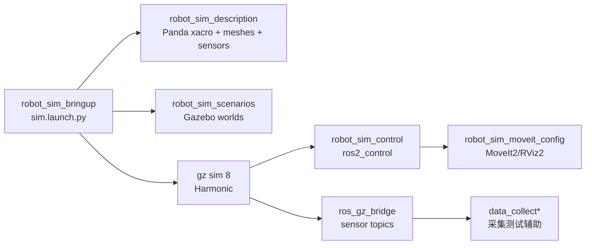

# robot_sim Gazebo 仿真工作空间
----
> 面向 ROS 2 Humble + gz sim 8/Harmonic 的机器人仿真、运控、传感器和采集测试文档

  
  
  
  

  <a href="#主要特性">主要特性</a> ·
  <a href="#系统架构">系统架构</a> ·
  <a href="#快速导航">快速导航</a> ·
  <a href="guide/simulation.md">仿真方案</a> ·
  <a href="workflow/testing.md">测试验收</a>

## 项目简介

`robot_sim` 当前以 Gazebo 仿真和机器人运控验证为主。核心入口是 `robot_sim_bringup`，它把 Panda 机械臂模型、Gazebo world、`gz_ros2_control`、MoveIt2、RViz2 和 `ros_gz_bridge` 组织成统一仿真链路。

数据采集、相机、Fanuc、桌面 UI 等模块仍保留在工作空间中，但定位调整为仿真联调和采集链路测试辅助能力。阅读本文档时，建议先从仿真运控链路看起，再按需进入采集测试章节。

## 主要特性

- 提供 `mock`、`light`、`full` 三档仿真模式。
- 使用 `gz_ros2_control/GazeboSimSystem` 在 Gazebo 中创建 controller manager。
- 提供 `joint_state_broadcaster`、`arm_controller` 和可选 `gripper_controller`。
- 支持 MoveIt2 规划执行和 RViz2 可视化。
- 支持 RGB、深度、点云、2D LaserScan、3D lidar 点云和 IMU 话题桥接。
- 提供 ROS 2 录包辅助入口，可按运控、传感器、全量和分布式话题组录制 rosbag2。
- 提供本机分布式 launch，用于模拟 robot、sensors、supervisor 进程拆分。
- 保留数据采集测试包，可用于验证仿真传感器话题和后续采集流程。

## 系统架构

## 目录一览

| 路径 | 说明 |
| --- | --- |
| `src/robot_sim_bringup/` | 仿真总入口、三档模式、传感器桥接和本机分布式启动 |
| `src/robot_sim_description/` | Panda 模型、传感器挂载、Gazebo 插件和 mesh 资源 |
| `src/robot_sim_control/` | ros2_control 控制器配置 |
| `src/robot_sim_scenarios/` | Gazebo world 场景 |
| `src/robot_sim_moveit_config/` | MoveIt2 规划和执行配置 |
| `src/gz_ros2_control/` | Humble + gz sim 8/Harmonic 的源码 overlay |
| `src/data_collect*` | 数据采集链路测试辅助 |
| `src/camera_*`、`src/fanuc_robot/` | 真实设备接入测试辅助 |

## 快速导航

- [仿真方案](guide/simulation.md) - 三档模式、传感器开关和控制链说明。
- [ROS 2 录包辅助](guide/rosbag-recording.md) - 按预设话题组录制仿真和运控数据。
- [开发运行](guide/run-app.md) - 编译工作空间并启动主要入口。
- [环境依赖与准备](guide/prerequisites.md) - ROS、Gazebo、SDK 和系统依赖。
- [模块总览](modules/README.md) - 快速找到每个包的职责。
- [接口参考](interfaces/ros-api.md) - ROS 主题、服务和 action 索引。
- [测试验收流程](workflow/testing.md) - 启动后检查控制器、话题和采集测试链路。
