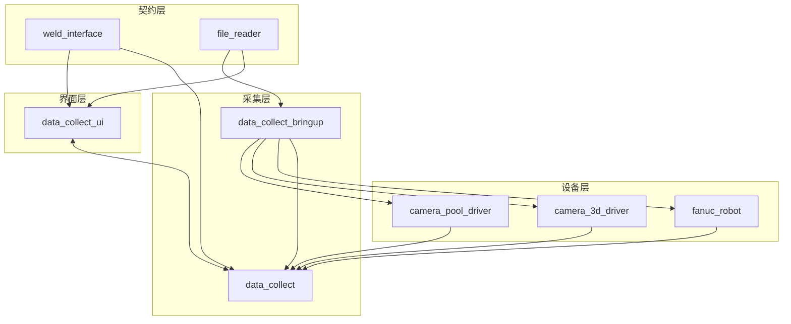

# 架构总览

焊接数据采集工作空间采用“Bringup 入口 + 功能节点 + 桌面操作台”的方式组织。配置文件统一从 `src/config/nodemanage.yaml` 注入，数据流通过 ROS 主题和服务连接各个节点。

## 组件分层

## 架构特点

- 节点职责清晰，采集、展示和配置分层管理。
- 所有硬件参数集中在 `nodemanage.yaml`，避免在代码中硬编码。
- 采集状态通过 ROS 话题向外广播，UI 通过服务完成控制动作。
- 任务和历史数据都可从同一个工作空间中追踪。

## 建议阅读顺序

1. [模块全景](module-overview.md)
2. [数据流](data-flow.md)
3. [状态模型](state-model.md)
4. [ROS 主题与服务](../interfaces/ros-api.md)
