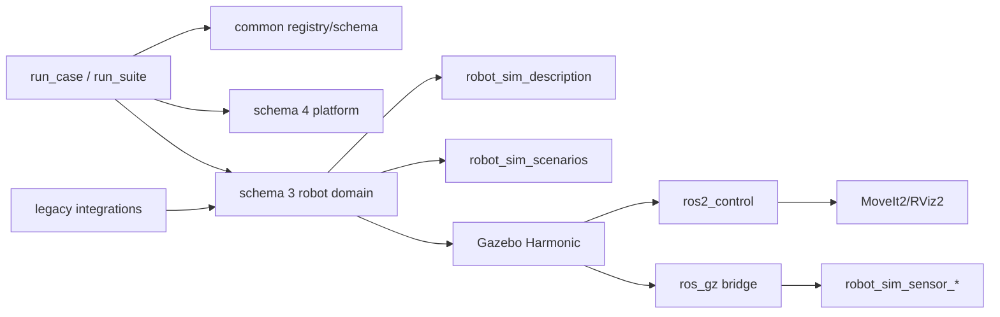

# 架构总览

`robot_sim` 现在有两条并列运行模型：

- `schema: 3` robot domain：保留机器人、Gazebo、MoveIt、ros2_control、scene/world/profile 和传感器验收链。
- `schema: 4` platform validation：面向通用 ROS2 pipeline，使用 system/data_source/adapter/assertion 做 topic/service/TF/process 契约验证。

`robot_sim_bringup` 的顶层 CLI 保持稳定，内部实现按 `common`、`platform`、`robot_domain`、`legacy_integrations`、`scaffold` 分层。

设计重点：

- ROS 包名和 launch 接口稳定。
- 新项目优先通过 v4 YAML 和少量 adapter 接入，不改核心 runner。
- 机器人差异集中在 profile、URDF/xacro、controller 和 MoveIt 配置中。
- 焊接/FANUC 旧能力作为 integration compatibility 保留，不作为通用平台架构默认模型。
- Gazebo Harmonic 通过仓库内 `gz_ros2_control` submodule overlay 接入。
- CI 使用 mock smoke 保持快速反馈，full smoke 由手动/定时 workflow 覆盖。
