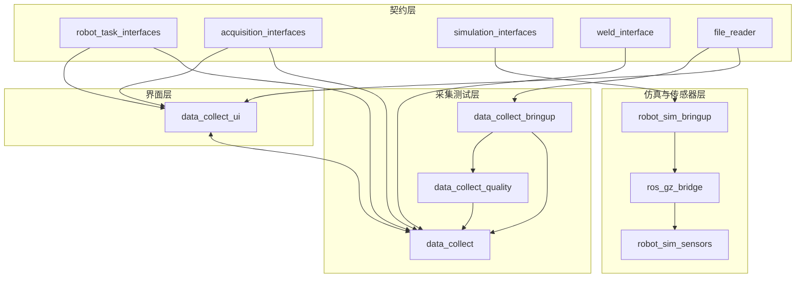

# 架构总览

`robot_sim` 当前采用“仿真 bringup + 运控配置 + 仿真传感器接收”的方式组织。仿真主链路由 `robot_sim_bringup` 驱动，world 由 `robot_sim_scenarios` 的 base/assets/scenario 组合生成；传感器数据通过 `ros_gz_bridge` 和 `robot_sim_sensors` 接收验证。旧硬件采集启动链路本轮暂不维护。

如果你的目标是把它继续演进成通用数据采集平台，建议先看 [目标架构草案](target-architecture.md)。这份文档会把 rosbag2、预览、质量评估和前端控制重新拆分成更轻的边界。

## 组件分层

## 架构特点

- 节点职责清晰，采集、展示和配置分层管理。
- 实际采集与仿真采集优先共享中性的 task/acquisition/simulation 接口，焊接字段由 `weld_interface` 作为 adapter 承载。
- 仿真链路由 `robot_sim_bringup` 的 `sim_mode`、scenario world 和传感器组开关控制，对应 gz sim 8、Panda 机械臂、Gazebo hardware plugin 和标准 ROS 2 控制器。
- 仿真传感器接收由 profile 中的 `sensors.<name>.receiver` 声明，receiver 订阅原生仿真话题并发布 diagnostics。
- 采集状态通过 ROS 话题向外广播，UI 通过服务完成控制动作。
- 任务和历史数据都可从同一个工作空间中追踪。

## 建议阅读顺序

1. [目标架构草案](target-architecture.md)
2. [模块全景](module-overview.md)
3. [数据流](data-flow.md)
4. [状态模型](state-model.md)
5. [ROS 主题与服务](../interfaces/ros-api.md)
