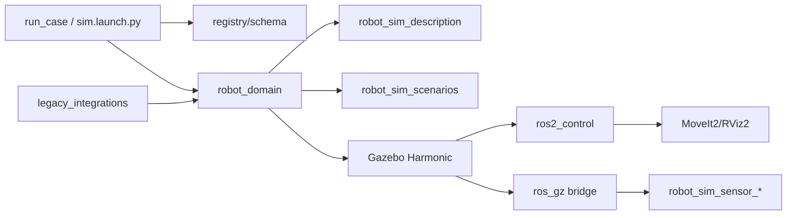

# 架构总览

`robot_sim` 现在只维护 `schema: 3` robot domain：

- robot profile、scene、world preset 和 validation case。
- Gazebo Harmonic、ros2_control、MoveIt2/RViz2 和 ros_gz bridge 启动链路。
- 传感器 receiver、profile lint、smoke helper 和运行产物报告。
- legacy 焊接/FANUC 外部模块集成。

通用 `schema: 4` ROS2 pipeline 验证已经拆到同级项目 `robot_validation`。

设计重点：

- 当前仓库不再运行 v4 case；遇到 `schema: 4` 会提示使用 `robot_validation`。
- 机器人差异集中在 profile、URDF/xacro、controller 和 MoveIt 配置中。
- Gazebo Harmonic 通过仓库内 `gz_ros2_control` submodule overlay 接入。
- CI 使用 mock smoke 保持快速反馈，full smoke 由手动/定时 workflow 覆盖。
