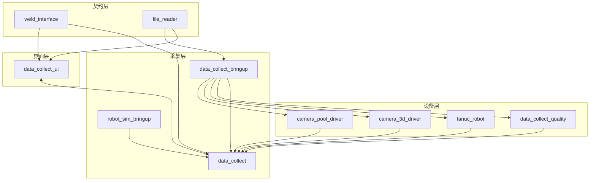

# 架构总览

焊接数据采集工作空间采用“Bringup 入口 + 功能节点 + 桌面操作台”的方式组织。真实设备链路由 `data_collect_bringup` 驱动，仿真链路由 `robot_sim_bringup` 驱动。配置文件通过 `src/config/nodemanage.yaml`、`robot_sim_control/config/panda_controllers.yaml` 和 launch 参数注入，数据流通过 ROS 主题和服务连接各个节点。

如果你的目标是把它继续演进成通用数据采集平台，建议先看 [目标架构草案](target-architecture.md)。这份文档会把 rosbag2、预览、质量评估和前端控制重新拆分成更轻的边界。

## 组件分层

## 架构特点

- 节点职责清晰，采集、展示和配置分层管理。
- 实际采集与仿真采集共享同一套 ROS 接口，便于切换和回归验证。
- 所有硬件参数集中在 `nodemanage.yaml`，避免在代码中硬编码。
- 仿真链路由 `robot_sim_bringup` 的 `sim_mode` 和传感器组开关控制，对应 gz sim 8、Panda 机械臂、Gazebo hardware plugin 和标准 ROS 2 控制器。
- 采集状态通过 ROS 话题向外广播，UI 通过服务完成控制动作。
- 任务和历史数据都可从同一个工作空间中追踪。

## 建议阅读顺序

1. [目标架构草案](target-architecture.md)
2. [模块全景](module-overview.md)
3. [数据流](data-flow.md)
4. [状态模型](state-model.md)
5. [ROS 主题与服务](../interfaces/ros-api.md)
