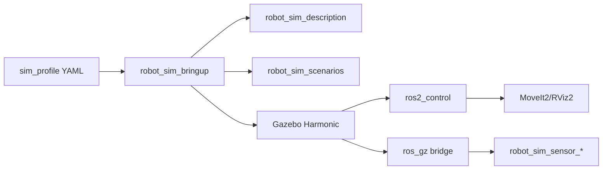

# 架构总览

`robot_sim` 采用 profile 驱动的 ROS 2 仿真架构。`robot_sim_bringup` 读取 profile，组合机器人描述、Gazebo world、controller、bridge、MoveIt 和 RViz 配置。

设计重点：

- ROS 包名和 launch 接口稳定。
- 机器人差异集中在 profile、URDF/xacro、controller 和 MoveIt 配置中。
- Gazebo Harmonic 通过仓库内 `gz_ros2_control` submodule overlay 接入。
- CI 使用 mock smoke 保持快速反馈，full smoke 由手动/定时 workflow 覆盖。
