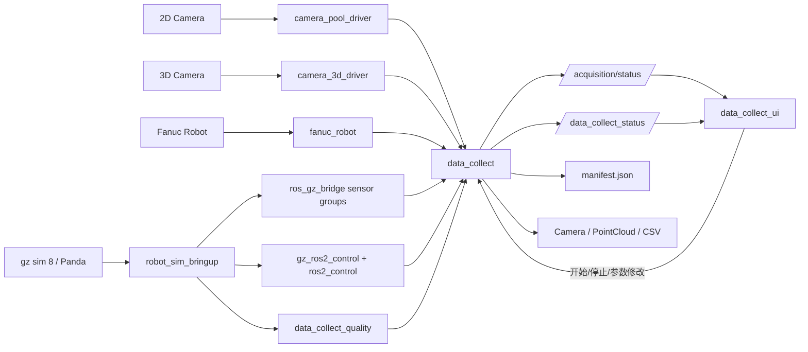

# 数据流

## 主数据流

## 关键流程

1. `data_collect_bringup` 读取 `nodemanage.yaml` 并启动各个节点。
2. 真实链路下，相机、机器人和质量节点先完成硬件初始化，再开始对外发布数据。
3. `robot_sim_bringup` 会按 `mock`、`light`、`full` 模式启动控制链、Gazebo 和可选传感器组，并从 scenario YAML 组合 world。
4. `data_collect` 根据任务状态和采样间隔决定是否保存数据。
5. `data_collect_ui` 订阅状态话题，并通过通用或旧兼容服务完成采集控制和任务录入。
6. 每次采集结束后会生成标准元数据，供历史检索使用。
