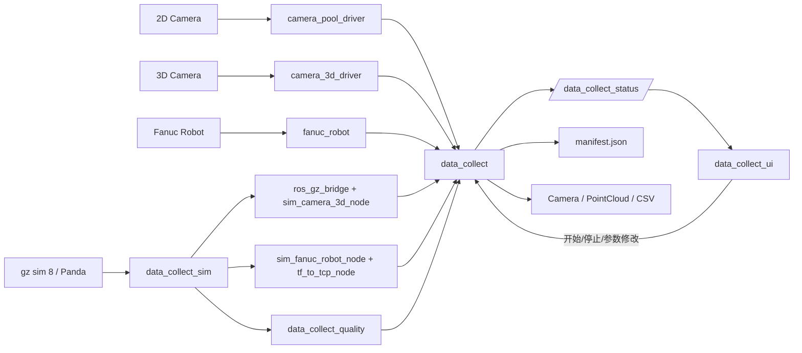

# 数据流

## 主数据流

## 关键流程

1. `data_collect_bringup` 读取 `nodemanage.yaml` 并启动各个节点。
2. 真实链路下，相机、机器人和质量节点先完成硬件初始化，再开始对外发布数据。
3. `data_collect_sim` 会启动 gz sim 8、Panda 机械臂、仿真机器人链和可选 mock 传感器链，用同一套 ROS 接口对外输出。
4. `data_collect` 根据任务状态和采样间隔决定是否保存数据。
5. `data_collect_ui` 订阅状态话题，并通过服务完成采集控制和任务录入。
6. 每次采集结束后会生成标准元数据，供历史检索使用。
