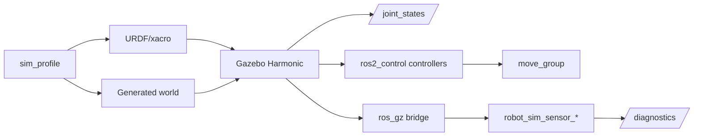

# 数据流

关键路径：

1. profile 决定机器人、world、controller、MoveIt、传感器和 bridge。
2. xacro 渲染出机器人描述并传给 `robot_state_publisher`、Gazebo 和 MoveIt。
3. Gazebo 通过 `gz_ros2_control/GazeboSimSystem` 创建控制链。
4. MoveIt 使用 controller action 执行规划轨迹。
5. 传感器数据经 `ros_gz_bridge` 到 ROS 话题，再由 receiver 统计并发布 diagnostics。
