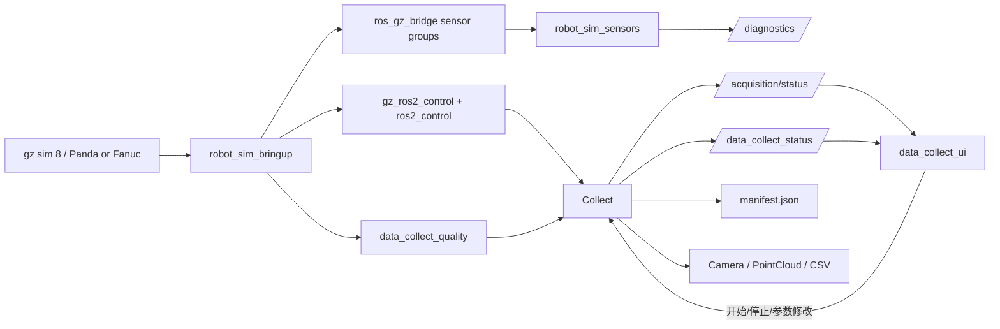

# 数据流

## 主数据流

## 关键流程

1. `robot_sim_bringup` 会按 `mock`、`light`、`full` 模式启动控制链、Gazebo 和可选传感器组，并从 scenario YAML 组合 world。
2. `sensor_receivers.launch.py` 根据同一个 `sim_profile` 启动 `robot_sim_sensors` receiver，订阅 bridge 后的仿真话题并发布 diagnostics。
3. 旧 `data_collect_bringup` 硬件启动入口本轮暂不维护。
4. `data_collect` 根据任务状态和采样间隔决定是否保存数据。
5. `data_collect_ui` 订阅状态话题，并通过通用或旧兼容服务完成采集控制和任务录入。
6. 每次采集结束后会生成标准元数据，供历史检索使用。
