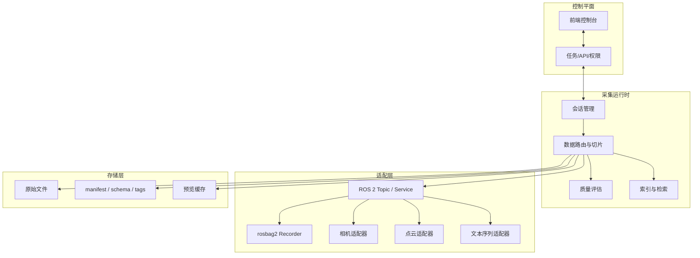

# 目标架构草案

这份草案面向“通用数据采集软件”目标，而不是继续按单一焊接项目扩张。核心思路是：把系统从“话题录制工具”升级为“语义化采集与质量评估平台”。

## 设计原则

- 采集对象从 topic 上升到任务、会话、事件和数据流。
- rosbag2 保留为底层录制能力之一，不作为系统主抽象。
- 前端只负责控制、预览和评估，不承载采集核心逻辑。
- 图像、点云、文本序列和状态数据共享同一套会话与元数据模型。
- 先保证采集质量和可追溯性，再追求接入更多设备。

## 推荐分层

## 你现在的系统该怎么收缩

建议把现有功能重新归并成 4 个稳定模块：

1. 采集核心
   负责会话生命周期、采样节流、落盘、元数据和状态发布。
2. 设备适配
   负责相机、机器人、传感器和 bag 录制接入。
3. 预览与评估
   负责 2D 图、3D 点云、时间轴和采集质量反馈。
4. 前端控制台
   只负责任务编排、启动停止、参数编辑和历史检索。

这样做的好处是：采集逻辑不会继续膨胀到 UI 或设备驱动里，系统边界会更清楚。

## rosbag2 应该放在哪里

rosbag2 适合做“可选录制器”，不适合做整个产品的中心。

更合理的方式是：

- 当用户选择“全量留档”时，启用 rosbag2 录制原始 topic。
- 当用户选择“任务级采集”时，由采集核心决定哪些 topic 需要保存、抽样或只做摘要。
- 当用户选择“质量优先”时，优先保存结构化元数据、关键帧和异常片段，而不是无差别堆积全部消息。

这样你既能保留 ROS 生态兼容性，又能做出比纯 bag 工具更高层的产品能力。

## 比 rosbag2 和 Foxglove 更有新意的点

- 语义化采集：按工单、工艺段、工位、任务模板开始和结束，而不是按 topic。
- 自动切片：按事件、状态阈值、异常窗口自动切出高价值片段。
- 采集质量门禁：录制结束立即给出同步偏差、丢帧、模糊度、点云完整度等评分。
- 一键回放对比：同一类任务可以横向对比多个 session，而不是单次看 bag。
- 结果导向：采集结果直接服务于训练、分析、复现和工艺追踪，而不是只服务于回放。

## MVP 路线

1. 先统一会话模型：task / session / stream / event / artifact。
2. 再接入三个最常用数据源：2D 图像、3D 点云、文本/状态流。
3. 然后加入 rosbag2 作为可选录制器。
4. 最后做预览缓存、质量评分和任务级检索。

如果目标是尽快落地，建议先别追求“接入一切”，而是先把一条完整链路做顺：任务创建 -> 自动触发 -> 数据保存 -> 质量评估 -> 历史检索。
